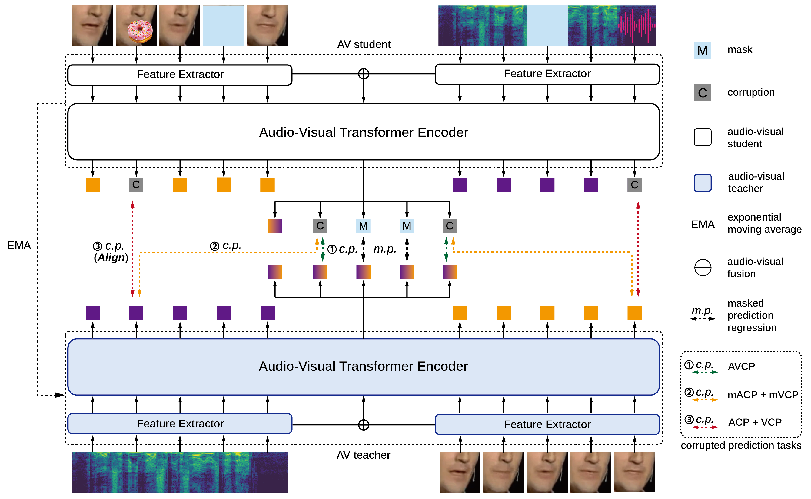

# CAV2vec (ICLR 2025)

<a href='https://arxiv.org/abs/2504.18539'></a>
<a href='https://openreview.net/forum?id=WEQL5ksDnB'></a>  <a href=#bibtex></a> 

<p align="center">

</p>

## **Multi-Task Corrupted Prediction for Learning Robust Audio-Visual Speech Representation**

[Sungnyun Kim](https://bit.ly/sungnyunkim),
[Sungwoo Cho](https://peter-sungwoocho.github.io/),
[Sangmin Bae](https://www.raymin0223.com/),
[Kangwook Jang](https://scholar.google.com/citations?user=p8GFX-sAAAAJ&hl),
[Se-Young Yun](https://fbsqkd.github.io)
(KAIST AI)

📣 **CAV2vec** is a self-supervised framework for robust audio-visual speech representation, effectively addressing **audio-visual joint corruptions** through **unimodal corrupted prediction tasks**.

🎧 CAV2vec demonstrates significant performance on **robust AVSR benchmark under various corruptions**: (*visual*) object occlusion, Gaussian noise with blur, hands obstruction, pixelation, (*audio*) babble, music, real-world indoor/outdoor noise, etc.


## BibTex

If you find this repo useful for your research, please consider citing our paper.
```BibTeX
@inproceedings{
    kim2025multitask,
    title={Multi-Task Corrupted Prediction for Learning Robust Audio-Visual Speech Representation},
    author={Sungnyun Kim and Sungwoo Cho and Sangmin Bae and Kangwook Jang and Se-Young Yun},
    booktitle={The Thirteenth International Conference on Learning Representations},
    year={2025},
    url={https://openreview.net/forum?id=WEQL5ksDnB}
}
```

# How to use

This repository is mainly built upon the [facebookresearch/av_hubert](https://github.com/facebookresearch/av_hubert) repo. Please follow their first few steps for setup.

## 1. Data pre-processing
Follow the steps for [data preparation](https://github.com/facebookresearch/av_hubert?tab=readme-ov-file#data-preparation) process (including the clustering to get `.km` labels).

- Prepare the LRS3 audio-video and MUSAN noise datasets.
- Make sure that `{train,valid}.tsv` are saved at `/path/to/data`, and `{train,valid}.km` are saved at `/path/to/label`.
- For the pretrained checkpoint, download `Noise-Augmented AV-HuBERT Large` model and place it under `/path/to/checkpoints/`. [[pretrained checkpoints](http://facebookresearch.github.io/av_hubert)]

## 2. Visual occlusion setup
Download `coco_object.7z` from [here](https://drive.google.com/drive/folders/15nZETWlGMdcKY6aHbchRsWkUI42KTNs5), extract, and place `object_image_sr` and `object_mask_x4` in `./occlusion_patch` directory.

Then, [extract landmarks](cav2vec/preparation/align_mouth_occ.py):
```sh
$ python cav2vec/preparation/align_mouth_occ.py --video-direc ${lrs3} --landmark ${landmark_dir} --filename-path ${lrs3}/file.list \
 --save-direc ${lrs3}/video --mean-face /path/to/mean_face --s /path/to/ffmpeg \
 --rank ${rank} --nshard ${nshard}
```
This will save the landmarks for occlusion under `/path/to/data/landmark_occ`.

## 3. Pretrain CAV2vec model
To train a model, run:
```sh
$ cd cav2vec
$ fairseq-hydra-train --config-dir conf/pretrain --config-name conf-name \
  task.data=/path/to/data task.label_dir=/path/to/label \
  task.noise_wav=/path/to/musan/tsv/all/ \
  model.label_rate=25 \
  model.w2v_path=/path/to/checkpoints/large_vox_iter5.pt \
  hydra.run.dir=/path/to/experiment/pretrain \
  common.user_dir=`pwd`
```
The pretrained CAV2vec checkpoint will be saved under `/path/to/experiment/pretrain/checkpoints/`.

If multi-gpu run occurs error (default process group ...), try this:
```sh
$ export PYTHONPATH=$PYTHONPATH:<your absolute path to fairseq submodule>
```

To run on a single gpu, set `distributed_training` and `optimization` config in yaml file as:
```
distributed_training:
  ddp_backend: c10d
  distributed_backend: 'nccl'
  distributed_world_size: 1  # ngpus
  nprocs_per_node: 8

...

optimization:
  update_freq: [8]  # 8 forward passes per step
```

## 4. Fine-tune CAV2vec model
Make sure that `{train,valid}.tsv` are saved at `/path/to/data`, and `{train,valid}.wrd` are saved at `/path/to/label`.

To fine-tune the pretrained CAV2vec at `/path/to/experiment`, run:
```sh
$ fairseq-hydra-train --config-dir conf/av-finetune --config-name conf-name \
  task.data=/path/to/data task.label_dir=/path/to/label \
  task.tokenizer_bpe_model=/path/to/spm-tokenizer \
  task.noise_wav=/path/to/musan/tsv/all/ \
  model.w2v_path=/path/to/experiment/pretrain/checkpoints/checkpoint_last.pt \
  hydra.run.dir=/path/to/experiment/finetune \
  common.user_dir=`pwd`
```

## 5. Decoding
Suppose the `test.tsv` and `test.wrd` are the video list and transcripts of
the split to be decoded, saved at `/path/to/data`, and the fine-tuned model is
saved at `/path/to/experiment/finetune/checkpoints/`.

#### Seq2seq decoding

Decoding results will be saved at `/path/to/experiment/decode/s2s/test`.
```sh
$ python -B infer_s2s.py --config-dir ./conf/ --config-name conf-name \
  dataset.gen_subset=test common_eval.path=/path/to/experiment/finetune/checkpoints/checkpoint_last.pt \
  common_eval.results_path=/path/to/experiment/decode/s2s/test \
  override.visual_corruption_max_freq=1 \
  override.visual_occ_type=coco \
  override.visual_noise=true \
  override.visual_corruption_prob=1.0 \
  override.noise_wav=/path/to/musan/tsv/babble \
  override.noise_prob=1.0 override.noise_snr={snr} \
  common.user_dir=`pwd`
```
`{snr}` is the signal-to-noise ratio (SNR) and `override.noise_wav` is a folder containing noise manifest files (`/path/to/noise/{valid,test}.tsv`). See [`preparation`](cav2vec/preparation/) for setting up this folder.

The command above uses the default decoding hyperparameter, which can be found in `conf/s2s_decode.yaml`. Also, the above example specifies babble noise (from MUSAN) for audio corruption and object occlusion with Gaussian noise for visual corruption. To change the audio noise, set `override.noise_wav` as different path to noise.

#### Test under unseen corruptions
If you want to test your model under other environments with unseen corruption types, try these:

- For DEMAND audio noise, prepare noise wav and tsv files referring to [here](cav2vec/preparation/README.md#demand-noise-preparation-optional). Change the noise path to `override.noise_wav=/path/to/demand/tsv/{ENVIRONMENT}`. 
- In our evaluation on DEMAND, we sampled noise SNR from range [-10, 10]. For this, change to `override.noise_snr=\'-10,10\'`.

For visual corruption:
- For visual corruption with hands occlusion, first prepare the [hands dataset](https://drive.google.com/drive/folders/15nZETWlGMdcKY6aHbchRsWkUI42KTNs5), and then place `11k-hands_masks` and `11k-hand_sr` in `./occlusion_patch` directory. Change the visual occlusion type to `override.visual_occ_type=hands` or `override.visual_occ_type=pixelate` (pixelation).
- In these cases, we used corruption frequency as 3 and did not use Gaussian noise. For this, change to `override.visual_corruption_max_freq=3` and `override.visual_noise=false`.


## Contact
For any details or clarification, please reach out to Sungnyun (ksn4397@kaist.ac.kr).
